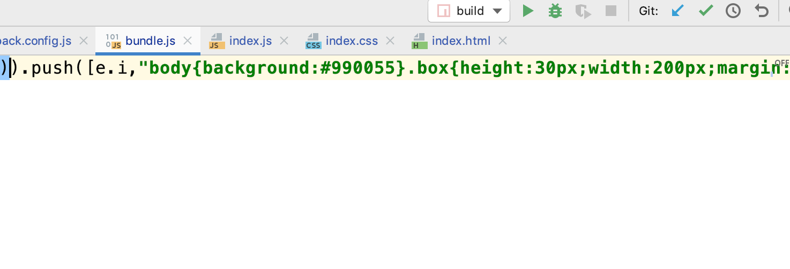

# webpack

## 可以做的事情

> 代码转换、文件优化、代码分割、模块合并、自动刷新、代码校验、自动发布

## 最终目的

- `webpack`的基本配置
- `webpack`的高级配置
- `webpack`的优化策略
- `ast`抽象语法树
- `webpack`的`Tapable`
- 掌握`webpack`的流程 手写`webpack`
- 手写`webpack`中常见的`loader`
- 手写`webpack`中常见的`plugin`

## 1. 安装`webpack`

- `webpack`
- `webpack-cli`
- 服务: `webpack-dev-server`
  - 不会真正的打包文件, 只会在内存中打包 运行命令 `npx webpack-dev-server`

## 2.配置文件

```js
let path = require("path");
let HtmlWebpackPlugin = require("html-webpack-plugin");
module.exports = {
  devServer: {//静态服务器的配置
    port: 3000,
    progress: true,//进度提哦啊
    contentBase: "./dist",//静态资源路径
    compress:true//是否压缩Gzip
  },
  mode: "production",//环境
  entry: "./src/index.js",
  output: {
    filename: "bundle[hash:8].js",//设置hash之后会解决浏览器缓存问题
    path: path.resolve(__dirname, "dist")//解析 会把相对路径解析成绝对路径
  },
  plugins: [
    new HtmlWebpackPlugin({//打包的时候 自动把html打包到dist目录
      template: "./src/index.html",
      filename: "index.html",
      minify:{
        removeAttributeQuotes:true,//去除双引号
        collapseWhitespace:true//单行压缩
      },
      hash:true//是否加hash后缀
    })
  ]
};

```


- 思考1: 如何压缩`html`文件
- 思考2: 如何实现命名的`hash`串

```js
 plugins:[
    new HtmlWebpackPlugin({
      template: './src/index.html',
      filename: 'index.html',
      minify: {
        collapseWhitespace: true,
        removeAttributeQuotes: true
      },
      hash: true
    })
  ]
```

### 修改样式

如果直接插入`css`文件会报一个这样的错误


解决:  下载两个loader

```js
  module: {//模块
    rules: [//规则
      {
        test: /\.css$/,
        use: [{
          loader: 'style-loader',//将css插入到head中
          options: {
            insert: 'top'//head/top foot
          }
        }, 'css-loader']
      },
      {
        test: /\.scss$/,
        use: ['style-loader','css-loader', 'sass-loader']
      }
    ],
  },
```


但是 此时 我们打包后发现 css是插入在js立面的



为了解决这个问题 接下来我们引入 

```js
import MiniCssExtractPlugin from 'mini-css-extract-plugin'
```


  