[TOC]

# `webpack`

## 可以做的事情

> 代码转换、文件优化、代码分割、模块合并、自动刷新、代码校验、自动发布

## 最终目的

- `webpack`的基本配置
- `webpack`的高级配置
- `webpack`的优化策略
- `ast`抽象语法树
- `webpack`的`Tapable`
- 掌握`webpack`的流程 手写`webpack`
- 手写`webpack`中常见的`loader`
- 手写`webpack`中常见的`plugin`

## 1. 安装`webpack`

- `webpack`
- `webpack-cli`
- 服务:` webpack-dev-server`
  - 不会真正的打包文件, 只会在内存中打包 运行命令` npx webpack-dev-server`

## 2.配置文件

```js
let path = require("path");
let HtmlWebpackPlugin = require("html-webpack-plugin");
module.exports = {
  devServer: {//静态服务器的配置
    port: 3000,
    progress: true,//进度提哦啊
    contentBase: "./dist",//静态资源路径
    compress:true//是否压缩Gzip
  },
  mode: "production",//环境
  entry: "./src/index.js",
  output: {
    filename: "bundle[hash:8].js",//设置hash之后会解决浏览器缓存问题
    path: path.resolve(__dirname, "dist")//解析 会把相对路径解析成绝对路径
  },
  plugins: [
    new HtmlWebpackPlugin({//打包的时候 自动把html打包到dist目录
      template: "./src/index.html",
      filename: "index.html",
      minify:{
        removeAttributeQuotes:true,//去除双引号
        collapseWhitespace:true//单行压缩
      },
      hash:true//是否加hash后缀
    })
  ]
};

```

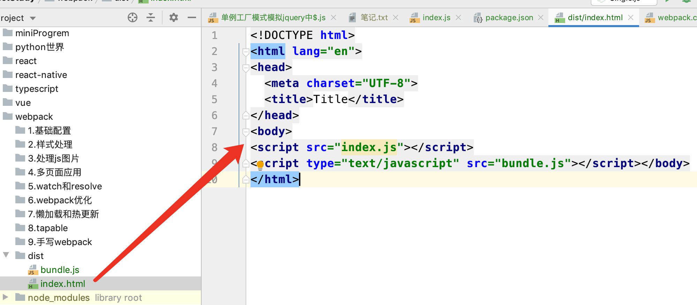

- 思考1: 如何压缩`html`文件
- 思考2: 如何实现命名的hash串

```js
 plugins:[
    new HtmlWebpackPlugin({
      template: './src/index.html',
      filename: 'index.html',
      minify: {
        collapseWhitespace: true,
        removeAttributeQuotes: true
      },
      hash: true
    })
  ]
```

### 2.1 修改样式

#### 2.2.1 loader配置

如果直接插入`css`文件会报一个这样的错误

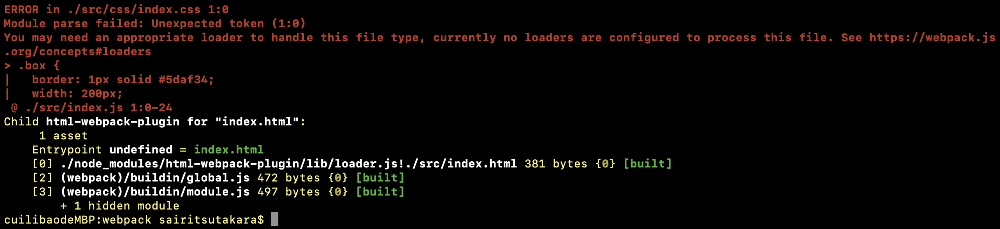

解决:  下载两个`loader`

```js
  module: {//模块
    rules: [//规则
      {
        test: /\.css$/,
        use: [{
          loader: 'style-loader',//将css插入到head中
          options: {
            insert: 'top'//head/top foot
          }
        }, 'css-loader']
      },
      {
        test: /\.scss$/,
        use: ['style-loader','css-loader', 'sass-loader']
      }
    ],
  },
```

#### 2.1.1 分离`css`

但是 此时 我们打包后发现 `css`是插入在`js`里面的

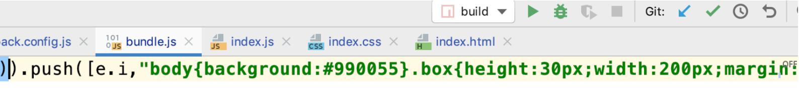

为了解决这个问题 接下来我们引入 `mini-css-extract-plugin`这个插件

```js
let MiniCssExtractPlugin require('mini-css-extract-plugin')

```

```js
 rules: [
      {
        test: /\.css$/,
        use: [{
          loader: MiniCssExtractPlugin.loader,
        }, 'css-loader']//loader顺序的规律
      },
      {
        test: /\.(sc|sa)ss$/,
        use: [{
          loader: MiniCssExtractPlugin.loader,
        }, 'css-loader', 'sass-loader']//loader顺序的规律
      }
    ]
```


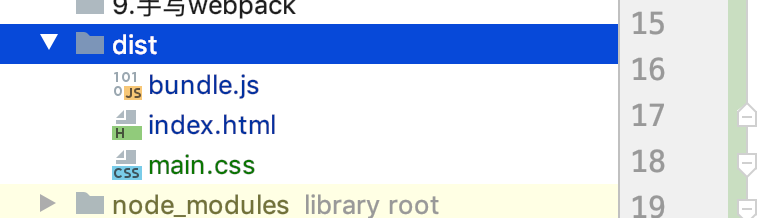


当我们加入`css3`之后 新的问题出现了 没有前缀

#### 2.1.3 引入前缀

此时 我们需要下载一个包`autoprefixer`以及一个`loader`文件`postcss-loader`

```js
{
        test: /\.css$/,
        use: [{
          loader: MiniCssExtractPlugin.loader,
        }, 'css-loader','postcss-loader']//loader顺序的规律
      },
```


2. 创建一个配置文件 `postcss.config.js`

```js
module.exports = {
  plugins: [require('autoprefixer')]
};
```

再次打包

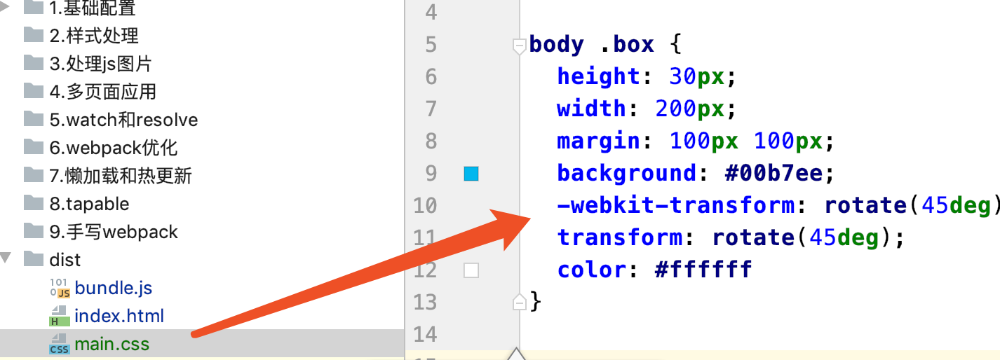

需要注意的是 此设置项只能用早生产环境

`mode: 'production',`

#### 2.1.4 压缩`css`文件

如何压缩文件呢

其中有个包 `optimize-css-assets-webpack-plugin`

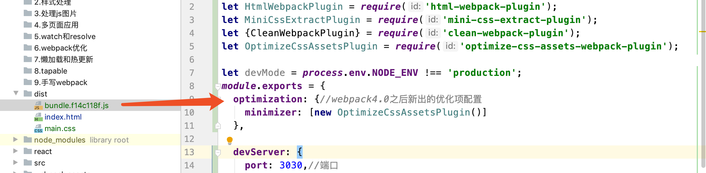

此包主要是用来压缩`css`的 但是 引入这个包后出现了`js`没被压缩的问题

怎么解决呢

按照官网配置需要使用`TerserJSPlugin`

https://www.npmjs.com/package/mini-css-extract-plugin

```js
optimization: {//webpack4.0之后新出的优化项配置
  minimizer: [new TerserJSPlugin({}), new OptimizeCssAssetsPlugin({})]
},
```

`TerserJSPlugin`具体参数查看这个

```js
interface TerserPluginOptions {
        test?: string | RegExp | Array<string | RegExp>;
        include?: string | RegExp | Array<string | RegExp>;
        exclude?: string | RegExp | Array<string | RegExp>;
        chunkFilter?: (chunk: webpack.compilation.Chunk) => boolean;
        cache?: boolean | string;
        cacheKeys?: (defaultCacheKeys: any, file: any) => object;
        parallel?: boolean | number;
        sourceMap?: boolean;
        minify?: (file: any, sourceMap: any) => MinifyResult;
        terserOptions?: MinifyOptions;
        extractComments?: boolean
        | string
        | RegExp
        | ExtractCommentFn
        | ExtractCommentOptions;
        warningsFilter?: (warning: any, source: any) => boolean;
    }
```

### 2.2 处理`js`文件

#### 2.2.1 babel核心模块

当我们尝试对写了`es6`语法的代码进行打包时候

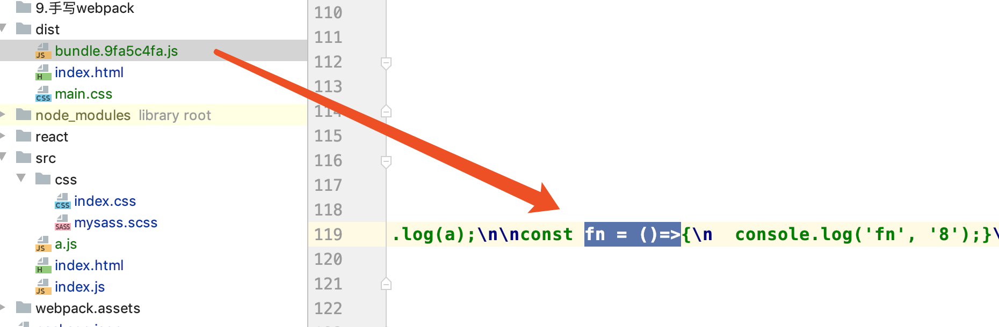

并没有变成`es5`

接下来执行命令

`yarn add babel-loader @babel/core @babel/preset-env`

- `babel-loader` : `babel`加载器
- `@babel/core` :` babel`的核心模块
- `@babel/preset-env` :  将`es6`转换成`es5`
- `@babel/plugin-transform-runtime`
- `@babel/runtime`
- `@babel/polyfill`

```js
{
        test: /\.js$/,
        use: [
          {
            loader: 'babel-loader',
            options: {//预设
              presets: ['@babel/preset-env']
            }
          }
        ]
 }
```

接下来 就是见证奇迹的时刻

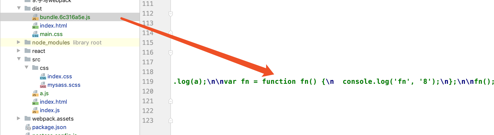

#### 2.2.2 处理箭头函数

`@babel/preset-env`

#### 2.2.3 处理装饰器

当我们添加装饰器 会有如下提示

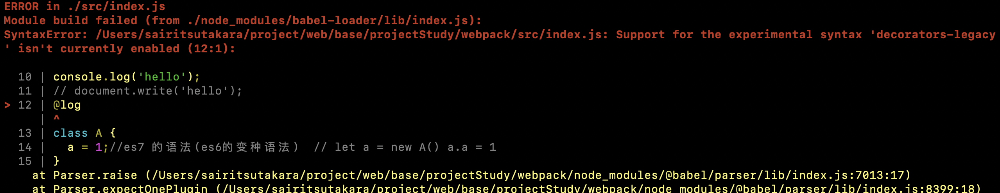

具体可以查看官网  https://babeljs.io/docs/en/babel-plugin-proposal-decorators 

```js
 {
        test: /\.js$/,
        use: [
          {
            loader: 'babel-loader',
            options: {//预设
              presets: ['@babel/preset-env'],
              plugins:[
                ["@babel/plugin-proposal-decorators", { "legacy": true }],
                ["@babel/plugin-proposal-class-properties", { "loose" : true }]
              ]
            }
          }
        ]
      },

```

`index.js`

```js
@log
class A {
  a = 1;//es7 的语法(es6的变种语法)  // let a = new A() a.a = 1
}
function log(target) {
  console.log(target,'21');
}

```

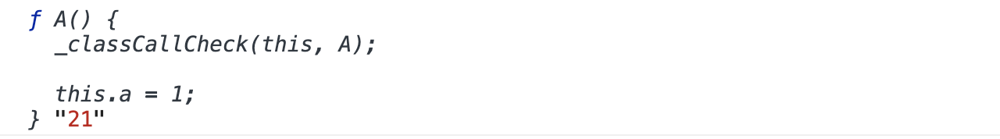

#### 2.2.4 处理`es7`语法

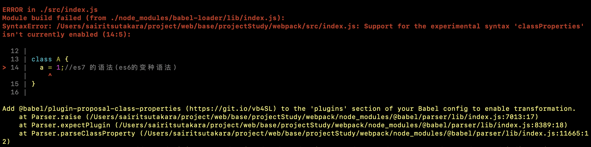

```js
{
        test: /\.js$/,
        use: [
          {
            loader: 'babel-loader',
            options: {//预设
              presets: ['@babel/preset-env'],
              plugins:['@babel/plugin-proposal-class-properties']
            }
          }
        ]
      }
```

`a.js`

```js
class B {

}

function* fnB() {
  yield 1;
}

console.log(fnB().next());

module.exports = 'a';
```

接下来打包发现 每个文件都会打包一个`_classCallCheck`

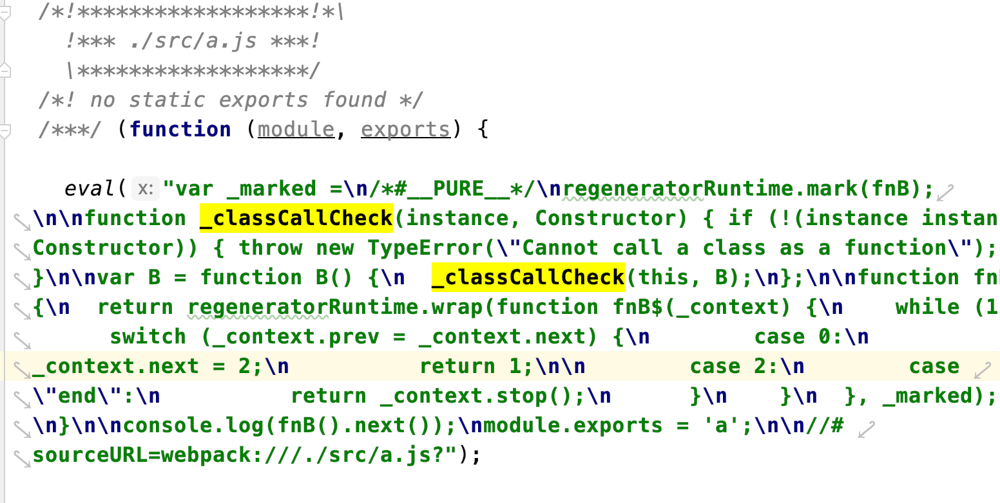

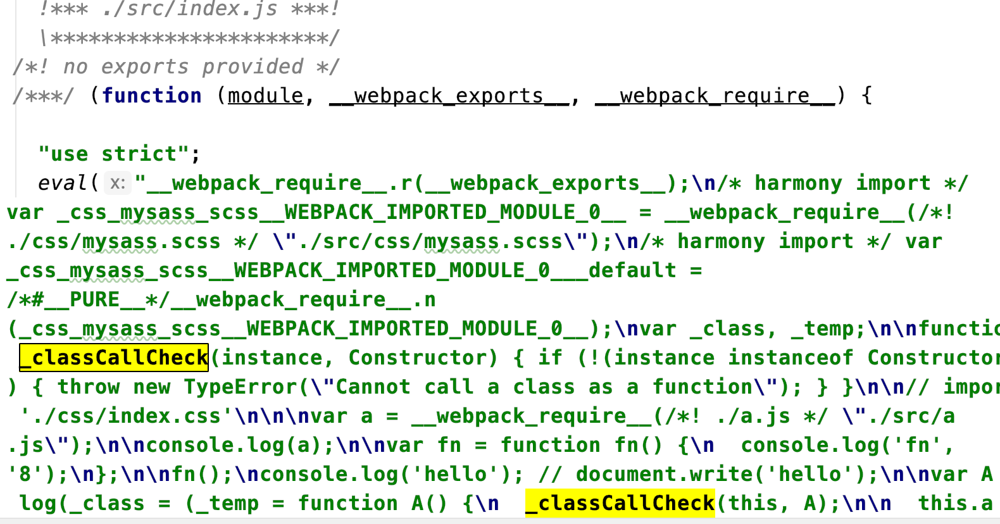

写了generator运行也会报错

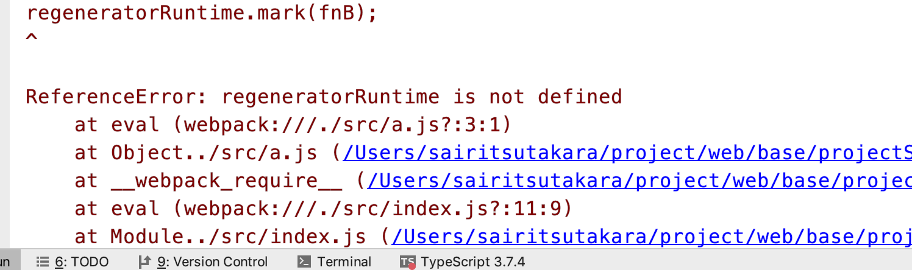

https://babeljs.io/docs/en/babel-plugin-transform-runtime#docsNav


接下来 

`yarn add `


#### 2.2.5 处理`eslint`


### 2.3 处理图片文件

#### 2.3.1 处理`js`中的图片

#### 2.3.2 处理`css`中图片文件

#### 2.3.3 处理`html`中的图片


